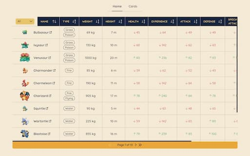

# Pokémon Explorer



Web application developed with React that allows you to explore Pokémon through:

- Interactive table with sorting, filtering, and pagination capabilities
- Responsive card view that adapts to different screen sizes

Both views allow access to a detailed modal with complete Pokémon information

## Main technologies used:

- Next.js
- TypeScript
- TailwindCSS
- Tanstack Table

**Live demo:** 🌐 https://pokemon-explorer-jvm.vercel.app

## Getting Started

First, run the development server:

```bash
npm run dev
# or
yarn dev
# or
pnpm dev
# or
bun dev
```

Open [http://localhost:3000](http://localhost:3000) with your browser to see the
result.
